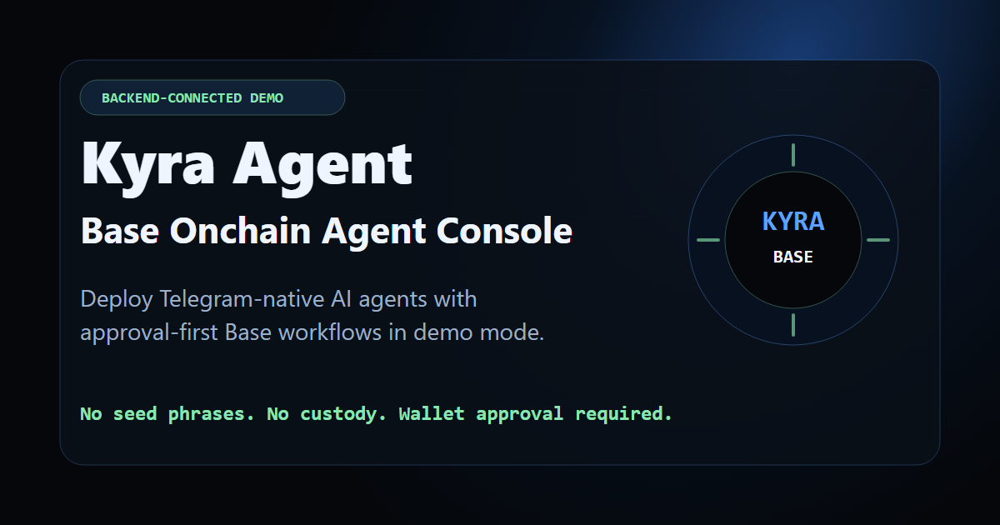

  

<h1 align="center">Kyra Agent</h1>

  Base-native AI agent console for deploying Telegram-native agents with
  approval-first onchain workflows.

  <a href="https://kyraagent.xyz">Website</a>
  &middot;
  <a href="https://x.com/Kyra_Agent">X</a>
  &middot;
  <a href="https://github.com/Kyra-Agent/Kyra">GitHub</a>

  
  
  

## Product Snapshot

Kyra Agent is a backend-connected product demo for creating AI agents that
operate through Telegram and prepare Base-native workflows behind explicit user
approval.

| Area                 | Current Status                                         |
| -------------------- | ------------------------------------------------------ |
| Agent deployment     | Demo agents can be created from templates              |
| Dashboard            | Private workspace view for deployed agents             |
| Public profiles      | Shareable agent identity and capability pages          |
| Telegram             | Live read-only commands and natural planning chat      |
| LLM layer            | Backend-only enrichment for eligible read-only replies |
| Wallet/Base layer    | Base Account readiness complete, execution still gated |
| Base MCP             | Read-only status bridge live; runtime gate default-off |
| Onchain transactions | Not live in the current demo                           |

## What Is Live

The canonical phase flow and exact meaning of `live` are maintained in
[`docs/product-phase-roadmap.md`](docs/product-phase-roadmap.md).

Phase 5 is complete: Telegram + LLM read-only interaction is live for connected
agent sessions.

Phase 6 is complete as a hardened foundation: wallet readiness, approval
policy, prepared-action review, risk review, signing handoff states, execution
result states, and Telegram execution refusal are modeled without enabling live
wallet prompts or onchain execution.

Current canonical roadmap status:

| Phase | Status |
| ----- | ------ |
| 1-5 | Product, backend, security, deployment, Telegram, and LLM read-only foundations complete |
| 6 | Wallet and approval foundation complete |
| 7 | Base Account + execution readiness complete; not live execution |
| 8 | Complete: controlled live transaction implementation closeout |
| 9 | Pending: public execution hardening |
| 10 | Pending: product release readiness |

Kyra can currently:

- Deploy demo agent profiles from templates.
- Persist demo records through the backend.
- Show private dashboard and public agent profile views.
- Reply in Telegram through read-only slash commands.
- Handle bounded natural Telegram chat for planning requests.
- Use backend-only LLM enrichment for eligible read-only replies.
- Show non-executing wallet/Base readiness and review surfaces.
- Prepare an explicit owner-dashboard read-only status bridge check behind
  refreshed session auth, backend ownership verification, protocol validation,
  persistent rate limits, and a default-off production gate.
- Refuse wallet, approval, Base MCP, swap, transfer, and onchain execution from
  Telegram.

## Telegram Command Surface

Connected Telegram agents support read-only commands:

| Command    | Purpose                                            |
| ---------- | -------------------------------------------------- |
| `/help`    | Show available commands and plain-text examples    |
| `/status`  | Report Telegram session and execution boundary     |
| `/agent`   | Summarize the deployed agent role and focus        |
| `/actions` | Show read-only actions and gated execution actions |
| `/modules` | Show the deployed template module stack            |
| `/policy`  | Explain the wallet/onchain safety boundary         |

Natural read-only prompts are supported for:

| Prompt Type     | Output                                            |
| --------------- | ------------------------------------------------- |
| Campaign plan   | Launch roadmap, phases, audience, and positioning |
| Market brief    | Read-only market/context summary                  |
| Narrative map   | Story angles and message structure                |
| Launch copy     | Announcement, thread, and CTA drafts              |
| Community pulse | Sentiment and engagement summary                  |
| Risk review     | Checklist-style risk framing                      |

Execution requests are refused from Telegram. Kyra can turn them into a
read-only plan, checklist, or risk review, but it cannot sign, approve, swap,
transfer, or call contracts from Telegram.

## Agent Templates

| Template   | Role                                   |
| ---------- | -------------------------------------- |
| Operator   | Personal wallet readiness agent        |
| Scout      | Recon and launch monitor               |
| Steward    | Project and community agent            |
| Executor   | Rule-based action readiness agent      |
| Strategist | Market and campaign intelligence agent |
| Custom     | User-defined modules and safety limits |

## Module Stack

Templates are the user-facing package. Modules are the internal capability
layer.

| Module   | Capability              |
| -------- | ----------------------- |
| NIRA-01  | Lead orchestration      |
| VEXA-02  | Recon and monitoring    |
| ASTRA-03 | Research and reasoning  |
| NOVA-04  | Data and context        |
| NYX-05   | Security and risk guard |

Different templates can use different module stacks depending on their role.

## Safety Boundary

Kyra is built around approval-first execution.

| Allowed Now                                | Still Gated                         |
| ------------------------------------------ | ----------------------------------- |
| Read-only Telegram commands                | Live wallet prompts                 |
| Natural planning chat                      | Token approvals                     |
| LLM-assisted planning replies              | Base MCP transaction execution      |
| Dashboard and public profiles              | Contract calls                      |
| Demo persistence                           | Live onchain transaction submission |
| Wallet/Base readiness and review surfaces  | Arbitrary swaps or transfers        |
| Read-only status bridge readiness          | Prepared-action production writes   |

Current boundaries:

- No private key custody.
- No seed phrase collection.
- No autonomous fund movement.
- No hidden transaction execution.
- No live wallet signing from Telegram.
- No Base MCP execution from Telegram.
- No official Base MCP OAuth registration, token, session, or tool call.
- No live onchain transaction submission in the current demo.
- Owner dashboard sensitive reads are column-scoped.
- Activity log messages are sanitized before display and backend persistence.

Future execution should remain wallet-approved: Kyra can prepare an action, but
the user's wallet must remain the final approval gate.

## Execution Readiness

Kyra has a hardened execution foundation, but live onchain execution is still
off. The current product can model wallet readiness, risk review, approval
states, prepared-action boundaries, signing handoff states, and sanitized
results without moving funds.

Phase 7 is complete as Base Account + execution readiness. It includes the
owner-click Base Account connection, prompt locks, prepared-action allowlist,
policy gates, dual approval modeling, result closeout modeling, and the
production smoke freeze checkpoint.

Phase 8 implementation is closed: one controlled live transaction path with one owner, one
deployed agent, one low-risk prepared action, explicit Kyra approval, explicit
Base Account approval, controlled submitter wiring, owner live-window activation lock, runtime enablement preflight, Base ETH gas readiness guard, result persistence hardening, funding UX hardening, live balance and gas readiness, first controlled low-value live run, transaction result verification, user-facing execution flow, security and abuse hardening, rollback readiness, and owner-only
result recording.

The intended execution path remains deliberately narrow:

1. The owner signs in to Kyra.
2. The owner selects one deployed agent.
3. The owner connects their own Base Account.
4. Kyra prepares one allowlisted action through a bounded adapter.
5. NYX-05 and deterministic policy produce a risk review.
6. The owner approves in Kyra.
7. The owner approves again in Base Account.
8. The user's Base Account submits.
9. Kyra records a sanitized owner-only result.

Nothing in the current demo skips the owner, wallet, approval, or audit gates. Phase 8 implementation is closed, and public execution stays Phase 9.

## Base MCP Boundary

Kyra supports a read-only Base status bridge for dashboard readiness checks. It
does not execute transactions.

Official hosted Base MCP remains a future optional adapter. It is not required
for Kyra's primary Base Account SDK path, and it stays disabled until provider
metadata, resource/audience, scope semantics, scope-to-tool mapping, consent,
token lifecycle, revocation, and owner approval are all verified.

The custom bridge smoke remains blocked until a compatible provider and reviewed
database rate-limit contract are approved. Readiness work is tracked through the
following audited packets:

- provider candidate intake gate
- provider candidate scoring worksheet
- candidate dossier fill gate
- SQL/verifier final approval packet
- controlled smoke closeout runbook
- provider evidence fill review
- provider candidate submission template
- target SQL approval prep
- final smoke authorization packet
- provider selection sandbox
- pre-provider audit

## Supporting Readiness

Older Phase 7A-Z documents are supporting evidence packets under Phase 7. They
are not extra public product phases and do not replace the 10-phase roadmap:

| Group | Scope |
| ----- | ----- |
| 1 | Read-only caller and status surface |
| 2 | Controlled smoke preparation and provider qualification |
| 3 | Official-provider decisioning and offline go/no-go review |
| 4 | Owner authority and consent blueprints |
| 5 | Disabled route skeleton and auth-helper readiness |

The detailed audit source remains
[`docs/product-phase-roadmap.md`](docs/product-phase-roadmap.md). The compact
closeout is maintained in
[`docs/supporting-readiness-closeout.md`](docs/supporting-readiness-closeout.md).

## Product Principles

- Product first.
- Telegram-native UX.
- Backend-only sensitive integration handling.
- Read-only before execution.
- Wallet approval before onchain action.
- No financial promises.
- No custody.

## Links

| Destination | URL                                |
| ----------- | ---------------------------------- |
| Website     | https://kyraagent.xyz              |
| X           | https://x.com/Kyra_Agent           |
| Repository  | https://github.com/Kyra-Agent/Kyra |
