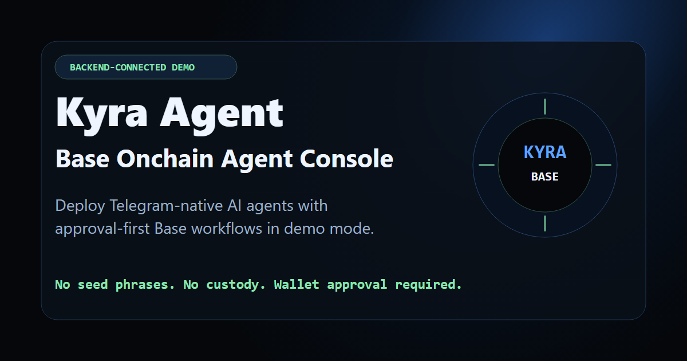

  

<h1 align="center">Kyra Agent</h1>

  Robinhood Chain AI agent platform for Telegram-native workflows,
  private agent workspaces, and approval-first onchain actions.

  <a href="https://kyraagent.xyz">Website</a>
  &middot;
  <a href="https://x.com/Kyra_Agent">X</a>
  &middot;
  <a href="https://github.com/Kyra-Agent/Kyra">GitHub</a>

  
  
  

## Product Snapshot

Kyra Agent lets users deploy account-scoped AI agents that operate through Telegram, maintain private dashboard records, and publish shareable agent profiles. Its onchain lane targets Robinhood Chain while wallet authority remains with the user.

Agents can understand intent, produce planning and risk context, and prepare bounded action reviews. Telegram stays read-only for wallet operations. Signing and submission require the connected user wallet, explicit approval, policy checks, and a private dashboard flow.

## Product Surface

| Surface | What it provides |
| --- | --- |
| Agent deployment | Template-based agent creation with account-scoped backend persistence |
| Dashboard | Private workspace for agents, Telegram state, wallet policy, and action readiness |
| Public profiles | Shareable agent identity, capabilities, commands, and safety policy |
| Telegram | Live read-only commands and bounded natural-language planning |
| LLM layer | Backend-only enrichment for eligible read-only replies |
| Robinhood Chain wallet | User-controlled EVM wallet connection and approval boundary |
| Execution path | Controlled review flow with policy checks and sanitized result handling |

## What Kyra Can Do

- Deploy agent profiles from focused templates and module stacks.
- Persist signed-in agent records through the backend.
- Publish private dashboard and public profile views.
- Reply in Telegram with read-only commands and planning chat.
- Convert risky wallet or transaction requests into review drafts.
- Bind prepared actions to Robinhood Chain and the selected deployed agent.
- Require explicit user and wallet approval before an onchain action can proceed.
- Preserve sanitized support, audit, and release evidence.

## Telegram Commands

Connected Telegram agents support a read-only command surface:

| Command | Purpose |
| --- | --- |
| `/help` | Show available commands and examples |
| `/status` | Report Telegram session and execution boundary |
| `/agent` | Summarize the deployed agent role and focus |
| `/actions` | Show available read-only and approval-required actions |
| `/modules` | Show the deployed template module stack |
| `/policy` | Explain the wallet and onchain safety boundary |

Every natural-language reply is bound to the deployed agent's persisted
template, role, actions, and module stack. The agent keeps that identity across
supported languages. Users may compare templates, but a deployed agent cannot
adopt another template's identity or capabilities. Foreign-template output is
rejected, repaired once through the backend provider, and replaced with a
template-safe response only if the provider still fails validation.

Execution-like requests are rejected before any LLM call. The LLM can enrich
eligible read-only planning, but it cannot authorize, approve, sign, or submit
an onchain action.

Natural prompts can produce campaign plans, market briefs, narrative maps, launch copy, community pulse summaries, and risk reviews. Swap, transfer, approval, contract, wallet, and transaction requests from Telegram are refused and converted into safe review output.

## Agent Templates

| Template | Role |
| --- | --- |
| Operator | Personal wallet readiness and action review agent |
| Scout | Recon and launch monitor |
| Steward | Project and community agent |
| Executor | Rule-based action readiness agent |
| Strategist | Market and campaign intelligence agent |
| Custom | User-defined workflow and safety limits |

Templates are the user-facing package. Kyra modules are the internal capability layer behind them.

| Module | Capability |
| --- | --- |
| NIRA-01 | Lead orchestration |
| VEXA-02 | Recon and monitoring |
| ASTRA-03 | Research and reasoning |
| NOVA-04 | Data and context |
| NYX-05 | Security and risk guard |

## Approval-First Execution

Kyra follows one rule: the agent can prepare, but the user wallet decides.

In this documentation, **owner** means the signed-in user who owns a private workspace and its agents. It is not a separate privileged Kyra account; platform-admin recovery controls remain separate and internal.

| Available surface | Protected boundary |
| --- | --- |
| Telegram read-only commands | Telegram-triggered wallet execution |
| LLM-assisted planning replies | Hidden transaction submission |
| Dashboard and public profiles | Seed phrase or private-key collection |
| Wallet connection readiness | Autonomous fund movement |
| Action review drafts | Contract calls without explicit approval |
| Sanitized result recording | Public exposure of wallet internals or tokens |

Current safety guarantees:

- No seed phrase collection.
- No private key custody.
- No hidden transaction execution.
- No Telegram-triggered signing.
- No public exposure of Telegram bot tokens.
- No raw session tokens, provider payloads, or wallet internals in public views.
- Account, wallet, chain, agent, action, and approval drift fails closed.
- Approval, risk review, receipt verification, rollback readiness, and privacy checks remain part of the execution path.

## Robinhood Chain Boundary

Robinhood Chain is Kyra's primary onchain target. Users connect a compatible EVM wallet in their private workspace, review the prepared action, and remain the final signing authority. Provider infrastructure supplies chain access but never replaces user consent or wallet authority.

The current public release supports agent deployment, private workspaces, Telegram read-only interaction, Robinhood Chain wallet connectivity, and approval-first action review. Transaction submission is restricted to authenticated, selected-agent, explicitly approved wallet flows; public profiles and Telegram cannot submit.

Kyra is an independent product and does not imply affiliation with, sponsorship by, or endorsement from Robinhood.

## Product Status

Kyra's product foundation, backend persistence, privacy boundaries, agent deployment, Telegram and LLM layer, wallet policy, Robinhood Chain execution workflow, and mainnet release lane are implemented and verified. The current transaction lane is deliberately bounded to one owner-approved `0.0001 ETH` self-transfer on Robinhood Chain mainnet, with immutable backend intent, exact receipt verification, and private backend closeout.

Transaction access remains deliberately narrower than the rest of the product. It is available only from an authenticated private workspace with selected-agent binding, a matching Robinhood Chain wallet, explicit user approval, deterministic policy and NYX-05 review, a short-lived one-time window, exact receipt verification, emergency disable, and privacy-safe evidence. Telegram and public profiles cannot sign or submit. Swaps, token approvals, arbitrary recipients, arbitrary values, and calldata remain blocked.

The current production hardening is live: immutable backend transaction intents, RPC-verified receipts, retry-safe Telegram delivery, session-scoped browser authentication, fresh-database bootstrap coverage, dependency scanning, and CI are deployed and verified. These controls strengthen the existing owner-controlled release lane without widening Telegram, public-profile, autonomous, token-approval, arbitrary-calldata, or hidden-signing access.

## Transaction Expansion

Kyra's next release track expands the bounded transaction lane in four grouped
phases. T1, native ETH plus official KYRA transfers, is implemented and verified
locally but is not production-active; migrations, Edge Function deployment,
bounded mainnet smoke, and explicit release approval remain. Later phases add
allowlisted swaps with exact
token approvals, security and operations hardening, then an audited mainnet
canary and staged public release. These capabilities are planned, not currently
public. Telegram, public profiles, autonomous execution, arbitrary calldata,
hidden signing, and private-key custody remain outside the product boundary.

See the [Transaction Expansion Roadmap](docs/transaction-expansion-roadmap.md)
for scope, release gates, and the current 8-12 working-day estimate.

Detailed engineering evidence is tracked in:

- [v1.0.0 Release Notes](docs/release-v1.0.0.md)
- [Changelog](CHANGELOG.md)
- [`docs/product-phase-roadmap.md`](docs/product-phase-roadmap.md)
- [Transaction Expansion Roadmap](docs/transaction-expansion-roadmap.md)
- [`docs/robinhood-chain-migration-blueprint.md`](docs/robinhood-chain-migration-blueprint.md)
- [`docs/robinhood-mainnet-cutover-runbook.md`](docs/robinhood-mainnet-cutover-runbook.md)
- [Product Readiness Snapshot](docs/product-readiness-snapshot.md)
- [Engineering documentation index](docs/README.md)

## Product Principles

- User wallet authority first.
- Telegram-native agent UX.
- Backend-only handling for sensitive integrations.
- Read-only by default; explicit approval before execution.
- No custody, no seed phrases, no hidden signing.
- Clear public copy, sanitized evidence, and explicit release controls.

## Links

| Destination | URL |
| --- | --- |
| Website | https://kyraagent.xyz |
| X | https://x.com/Kyra_Agent |
| Repository | https://github.com/Kyra-Agent/Kyra |
